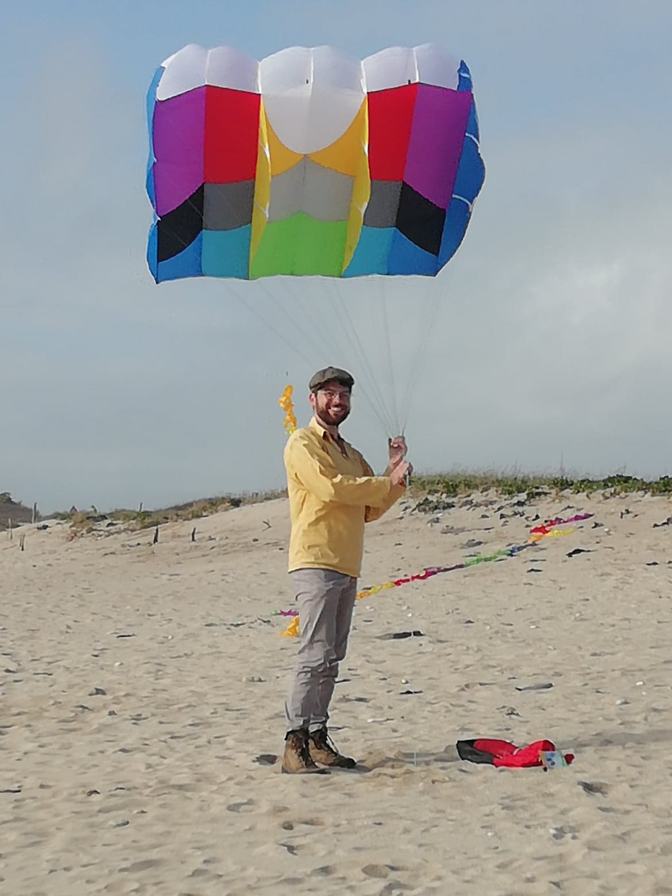
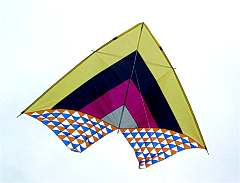

# Acheter un cerf-volant pour la Photo
Les cerf-volants pouvant servir à la photographie aérienne doivent pouvoir tirer une charge permettant de soulever la nacelle, mais ils doivent surtout pouvoir voler de la manière la plus stable possible. Pour finir il sera préférable lorsque le vent molli que ce dernier redescende doucement et évite le décrochage. 

Cette page de documantation inclut des retours d'expérimentations comme des informations collectés auprès d'autres personnes pratiquant la photographie aérienne par cerf-volant. 

|    Visuel    |Nom|Caractéristiques|Atouts Vs Défauts|
|----------|----------|--------------------|---------------------|
||[KAP foil 3.0](http://www.ennapurna.com/cerf-volant-porteur-hq-kap-foil.html)| **(1)** a.Surface 3 m² b.Taille 180*160cm **(2)** Recommandé pour des vents moyens de 4 à 27kts|**(A)**a.Sans structure rigide donc peu dangereux b. Forte puissance **(D)**a. Ne monte pas réellement à la verticale b.Parfois trop puissant pour être manoeuvré seul b.Difficile à faire décoller seul. |
||[Conyne delta](https://www.bilboquetsport.com/fr/cerfs-volants-monofils/18656-cerf-volant-delta-conyne-alpine.html)|**(1)** a.Surface 1,96 m² b.Taille 305*129cm **(2)** Recommandé pour des vents moyens |**(A)**a.Structure rigide b. Grande envergure **(D)** |
||[Delta SV4 carbon](http://becot.info/tako/francais/delta_SV4.htm)| **(1)** a.Surface 4,3 m² b.Taille 420*205cm **(2)** Recommandé pour des vents faibles|/|
