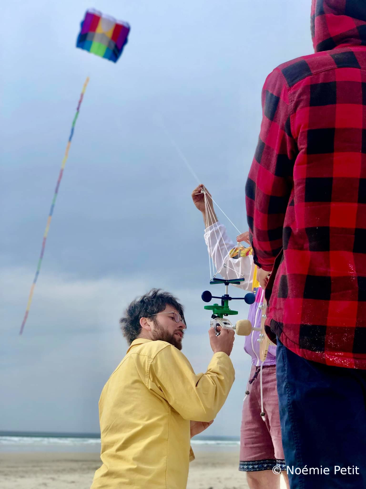

# Pratiquer la photographie aérienne (Mais Low Tech)
La photographie aérienne est facile aujourd'hui, il suffit de s'équiper d'un drone. Pourtant les drones sont bruyant et rare sont ceux qui apprécient en avoir un au dessus de sa tête lors d'une balade en pleine nature. A [Konk Ar Lab](https://www.konkarlab.bzh/) nous travaillons donc une technique bien plus ancienne que l'invention de l'avion. Il s'agit de la photo aérienne par cerf-volant. Il suffit d'envoyer un grand cerf-volant monofil se stabiliser à haute altitude. On installera sur le fil une treanteine de mètre plus bas une nacelle sur laquelle est fixé une caméra. Cette caméra sera programmé pour capturer une série de photos. C'est la hasard qui nous livrera de belles prises.
Cette technique est d'avantage respectueuse de l'environnement. Elle empreinte le vent lorsque le ciel se laissera photographier. Les images ne sont pas volés, elle s'envolent. Un cerf-volant c'est moins inquiétant qu'un drone, c'est silencieux. En prime c'est beau, au regard de ses multiples couleurs.

**Equipe :** Philippe, [Guillaume Leguen](http://www.guillaumeleguen.xyz/?PagePrincipale) Malo
