# Cerf-volant Cube (Toile)
## 1/ Introduction
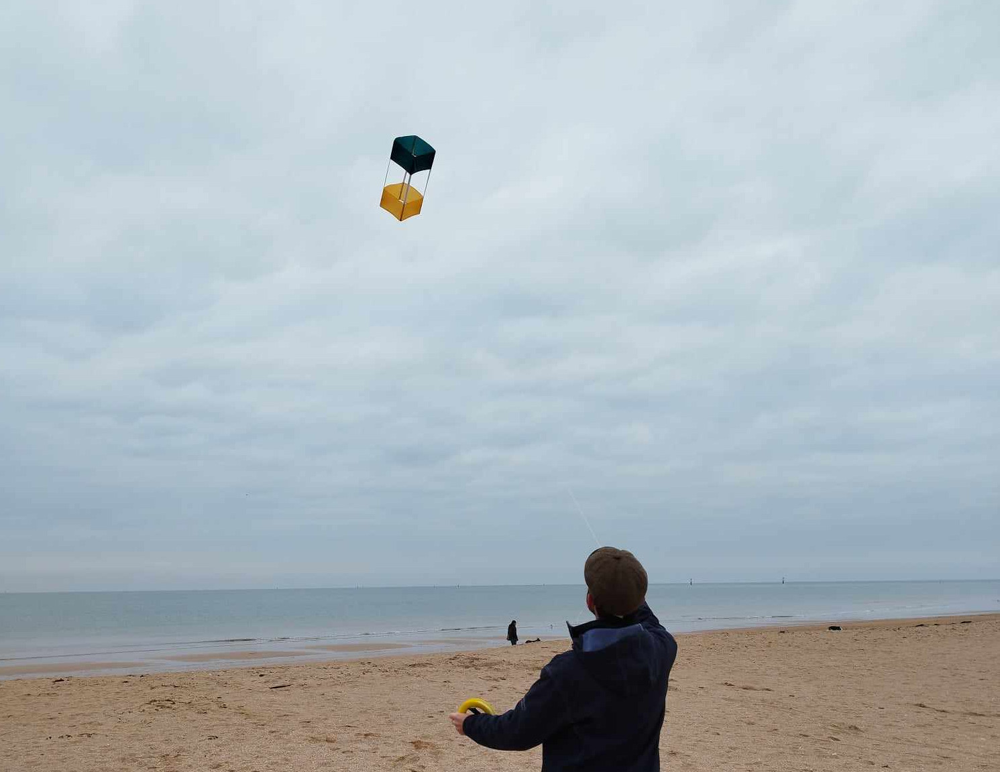
Le cerf-volant cube ou cerf-volant boite ou encore box kite est constitué de 4 longerons et de deux bandes de toiles cousus. Sa forme rappel les cerf-volants des pionniers de la photographie aérienne. 
C'est une forme de base, qui permettra de débuter la construction de cerf-volants. 

## 2/ Matériel et fournitures nécessaire
### 2.1 Fournitures

|Dénomination|Visuel|Mes fournitures|Qt|
|------|------|-----|--|
|Toile de spi (2 bandes de 270mm*1500mm minimum)|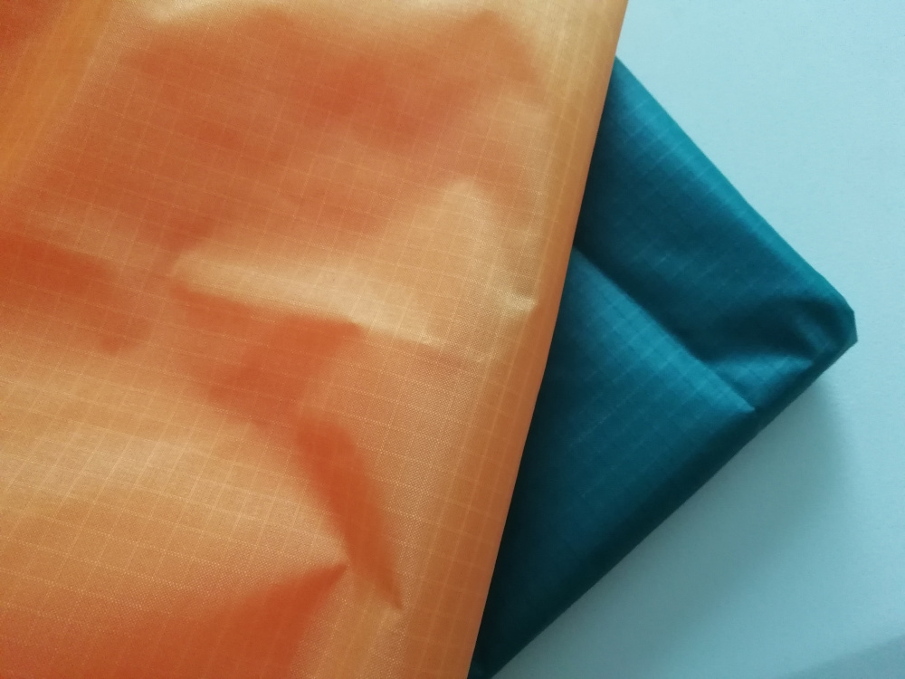|[La boutique du cerf-volant](https://www.boutiqueducerfvolant.com/fr/153-tissu-spinnaker-mirai-.html)|1|
|Fil de couture|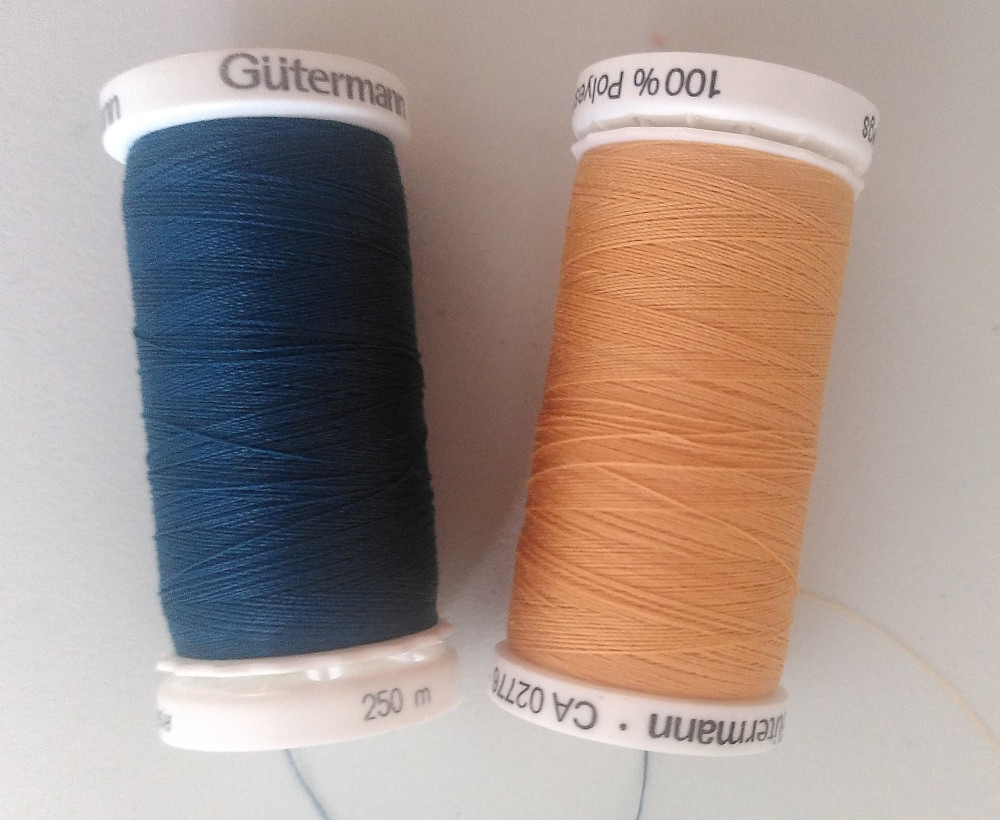|Gütermann Polyesther|1 / couleur|
|Tiges de bois de 1m de longueur et 6mm de diamètre.|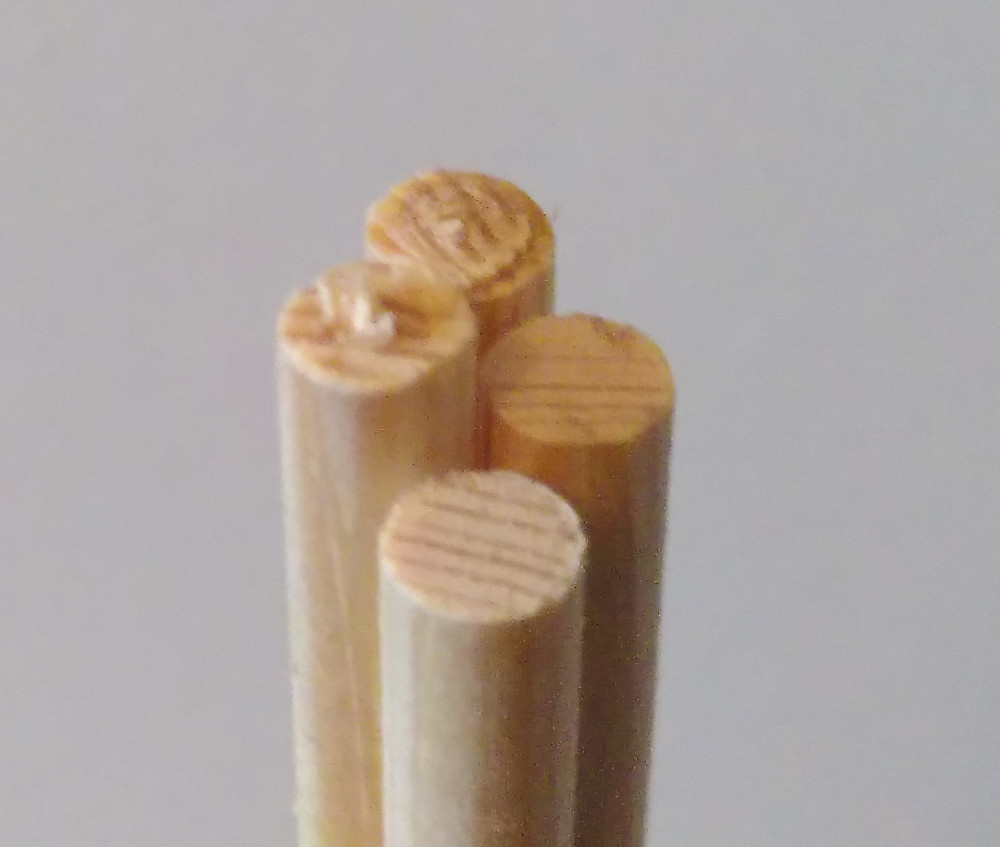||6|
|Bande extra-fort de 2,5cm de largeur|||4m|
|Ligne 35kg de charge environ en dacron|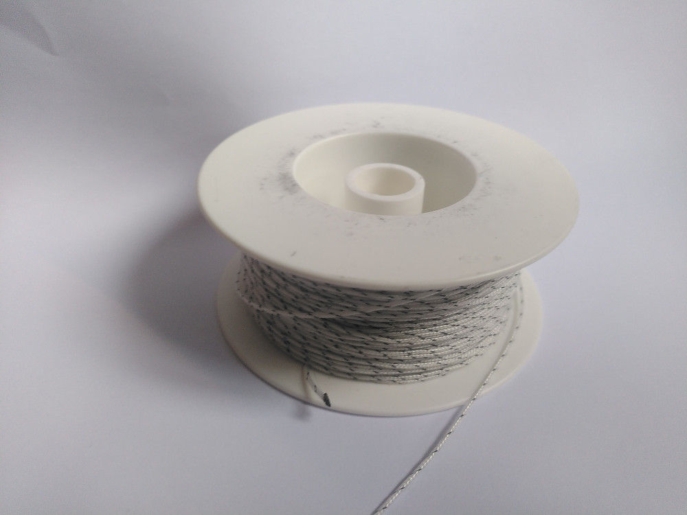||100m|

### 2.2 Matériel
|Dénomination|Visuel|Mon matériel|Qt|
|------|------|-----|--|
|Paire de ciseaux de couture|||1|
|Machine à coudre||Singer F527C|1|
|Aiguille de machine à coudre|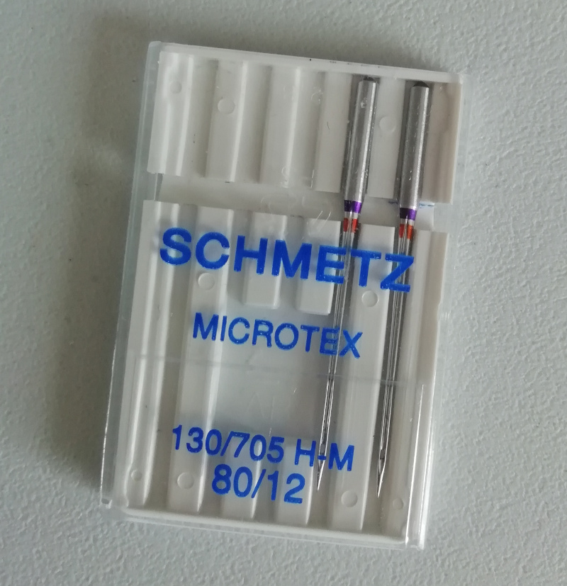|Schmetz Microtex T80/12|1|
|Règles et mètres rubans|||1|
|Craie ou feutre de couture|||1|
|Briquet|||1|

### 2.3 Spécificité des jonctions
Afin de connecter les tiges traversantes (vergues) aux longerons, il conviendra d'utiliser des connecteurs adéquats. 
**Deux solutions sont possibles** : Acheter les connecteurs (*cf 2.3.1*) ou les imprimer à partir du modèle 3D fourni (*cf 2.3.2*).

#### 2.3.1 Acheter les jonctions

|Dénomination|Visuel|Mes fournitures|Qt|
|------|------|-----|--|
|Jonctions (embouts fendu) **Attention !! sélectionner les embouts 6mm**|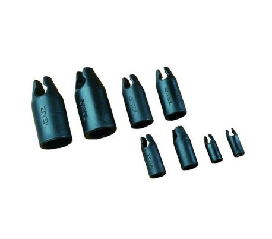|[La boutique du cerf-volant](https://www.boutiqueducerfvolant.com/fr/162-embouts-fendus-exel.html)|8|

#### 2.3.2 Imprimer les connecteurs en 3D
Cette documentation contient des connecteurs T de 6mm à clipser à imprimer en 3D. 
**Pour cela il faut disposer du matériel suivant :** 

|Dénomination|Visuel|Mes fournitures|Qt|
|------|------|-----|--|
|Le modèle 3D qui peut être téléchargé sur ce dépot|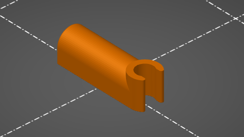|**STL : ** [La version .stl se télécharge directement dans l'archive](https://github.com/gheleguen/KiteAerialPhotography/blob/main/hardware/box_kite/BK_v0-1/connecteur_T_boxkite v3.stl) **Modifiable :** [En cas de besoin, il est possible de modifier la pièce en utilisant le fichier .f3D éditable sur Fusion360](https://github.com/gheleguen/KiteAerialPhotography/blob/main/hardware/box_kite/BK_v0-1/connecteur_T_boxkite v3.f3d)|1|
|Une imprimante 3D|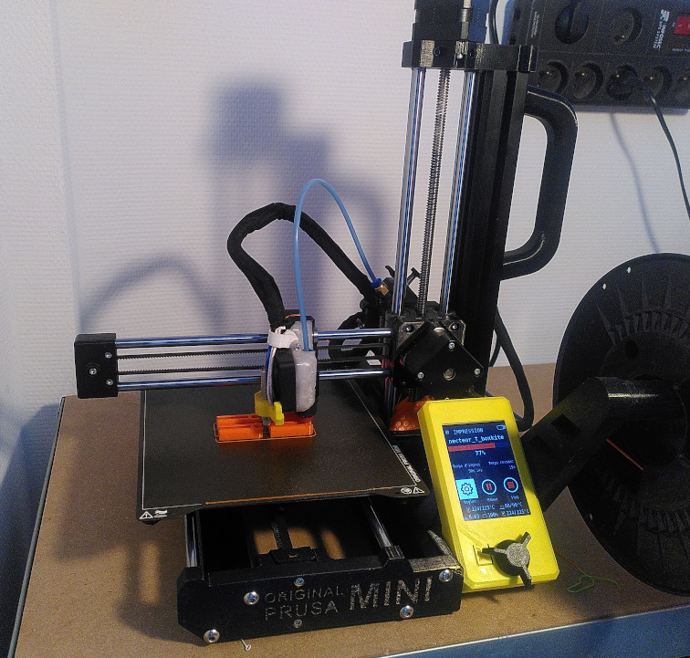|Dans mon cas je dispose d'une [Prusa Mini+](https://www.prusa3d.com/fr/categorie/original-prusa-mini/) mais pour cette pièce à peut près toutes les imprimantes à filaments conviendront (FDM)|1|
|10 g de filament de PETG ou PLA au diamètre adapté à l'imprimante utilisé|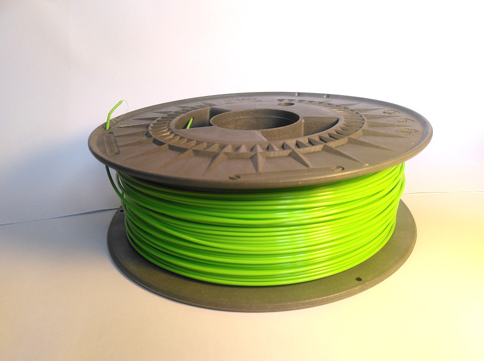|Je commande souvent mon filament chez [Arianeplast](https://www.arianeplast.com/) en France|1|

**Imprimer les connecteurs :**
 - Imprimer **8 connecteurs**. 
 - Les paramètres que j'ai utilisé sont les suivants :
   - **Diamètre de la buse :** 0,4mm
   - **Épaisseur de couche :** 0,15mm
   - **Remplissage :** 15%

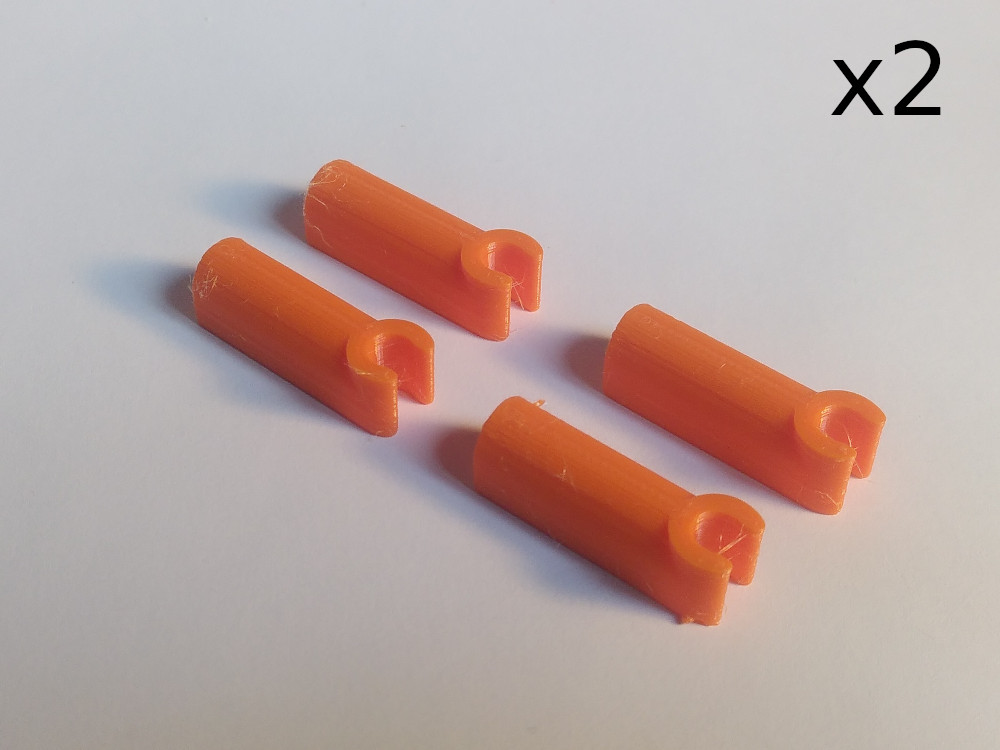
   
 
## 3/ Réalisation
### 3.1 Préparation des voiles
- Découper deux bandes de toile de 1,5m sur 27cm dans la toile de spi. Veiller au bon sens du fil.

- Marquer la ligne de couture à 1cm de chacun des long cotés. 
- Piquer les ourlets sur les deux bords de chaque bande. De préférence avec un point zig-zag.
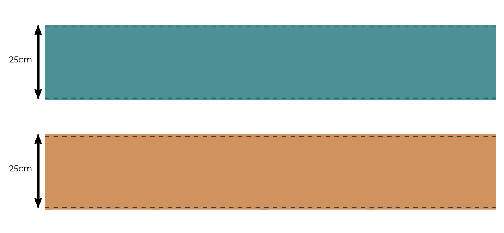

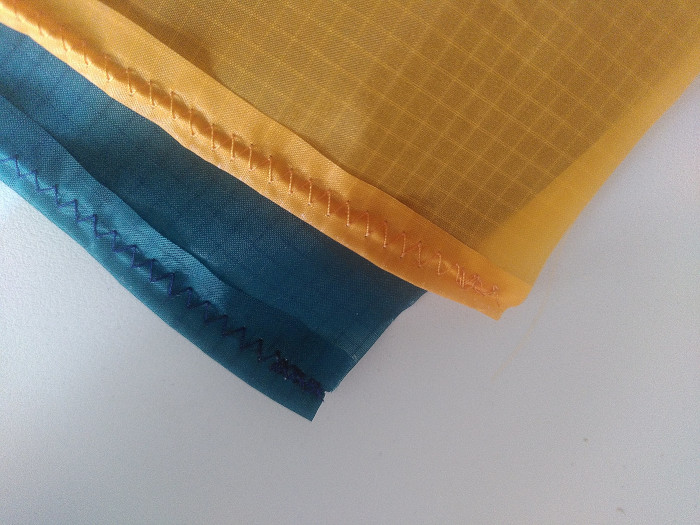

### 3.2 Pose de l'extrafort
- Sur chacune des bandes de toile tracer le positionnement des bandes extra-forts. En partant du bord à 2,5cm, puis 34,5cm puis 2,5...( cf. Schèma ci-dessous).

- Couper 4 bandes d'extra-fort de 96cm de longueur. 
- Positionner les quatre bandes d'extra-fort aux emplacement tracés préalablement. Ces dernières devront dépasser de 3cm de la bande de toile. Maintenir les pièces ensemble au moyen d'épingles. 

- Piquer le long des deux côtés l'extra-fort sur la toile de spi (avec un point zig-zag). On commencera la couture à 3cm du bord soit à 6cm du bout de l'extra-fort (cf. Schèma ci-dessous).

- A l'autre extrémité des bandes extra-fort, coudre la seconde bande de toile de manière symétrique à la première. Toujours laisser dépasser l'extra-fort de la bande de toile de 3cm, ainsi que ne débuter la couture qu'à 3cm du bord. 

### 3.3 Confection des goussets
 - Pour confectionner les goussets de longeron, replier l'extrafort sur lui même. Coudre de part et d'autre de manière a ce qu'une baguette de bois puisse y être inséré. 
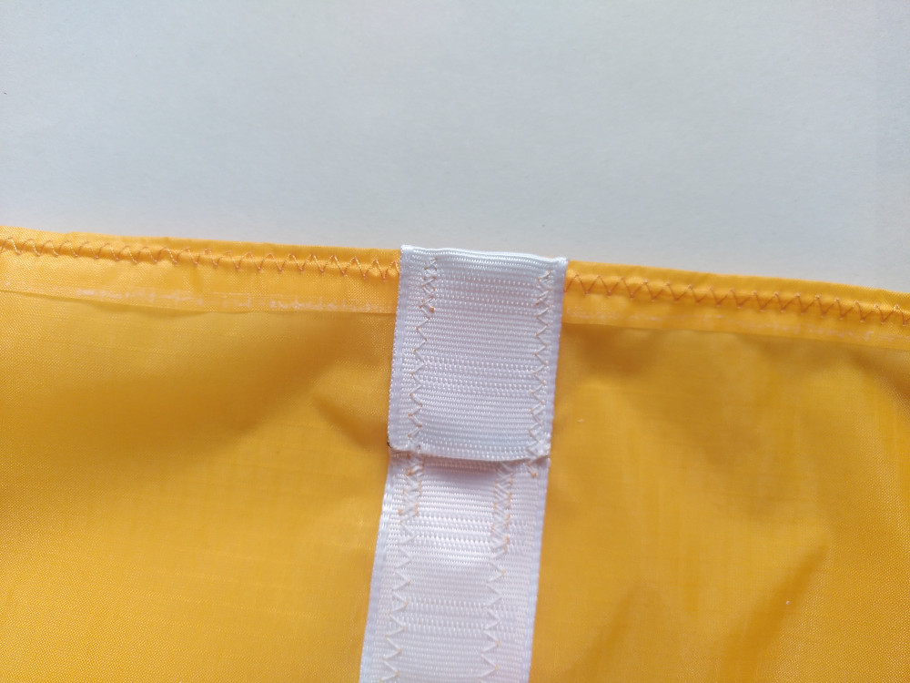

### 3.4 Points d'ancrages de la bride
 - Réaliser sur un des extrafort à 4cm du bord supérieur un trou au ciseaux, cautériser à l'aide d'un briquet. Ce trou permettra de passer la bride.
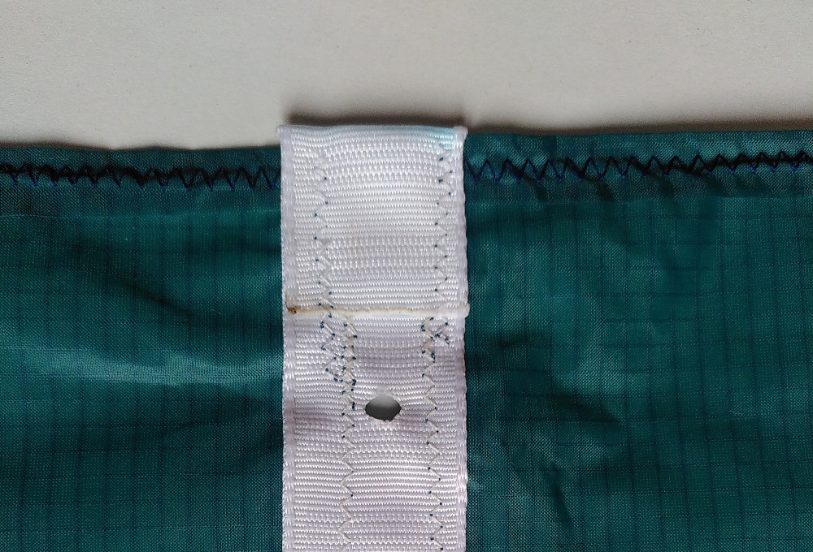
 - Réaliser sur cette même bande d'extrafort un second trou au dessus du bord intérieur de la bande opposé. 
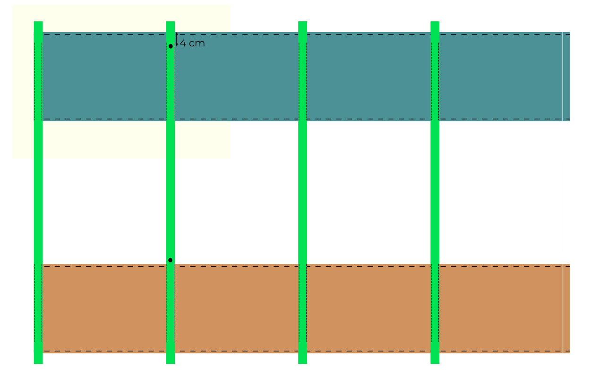
 - Cautériser à l'aide d'un briquet.
 

### 3.5 Assemblage
 - Refermer les bandes en piquant le bord marqué d'une ligne sur le bord de l'extrafort opposé. 
 - Faire de même sur les deux bandes en veillant à ne pas inverser le sens et ainsi éviter les vrilles. 
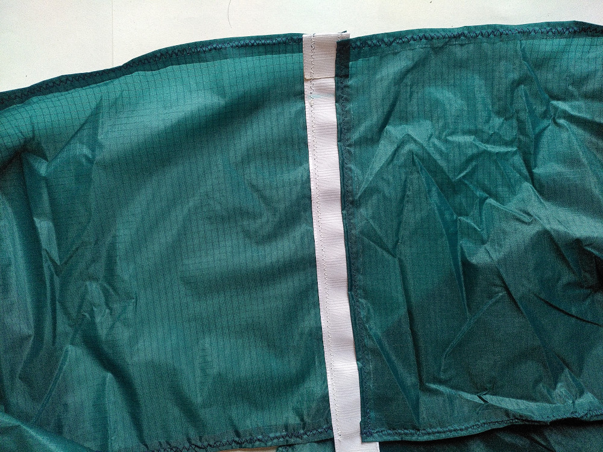

### 3.6 Pose des longerons
 - Insérer une baguette en bois dans un des goussets, tout en tendant fermement la bande, marquer la tige au feutre au en se servant du bord supérieur opposé. 
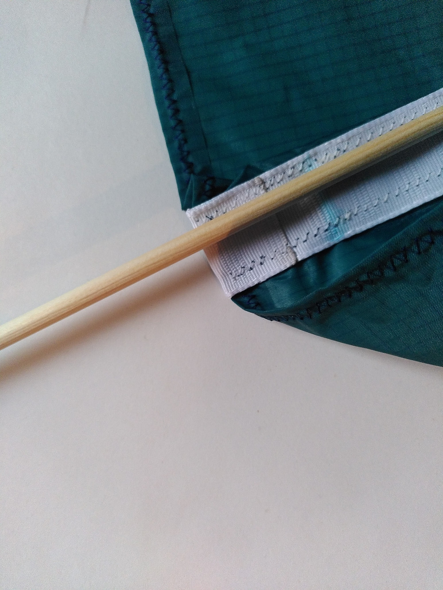

 - Couper cette première tige. Puis l'insérer le long d'une bande en la pliant légèrement afin qu'elle puisse rentrer dans les goussets opposés.
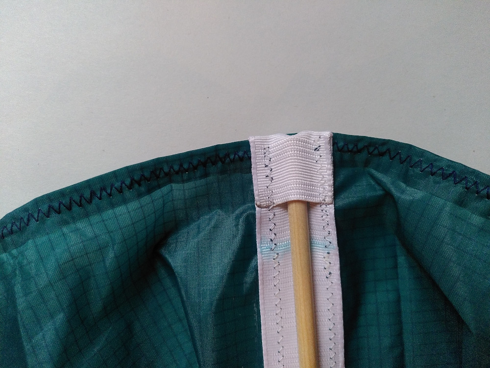

 - Tailler de la même manière les 4 baguettes. 
 - Insérer les 4 tiges, chacune le long d'une bande d'extrafort.
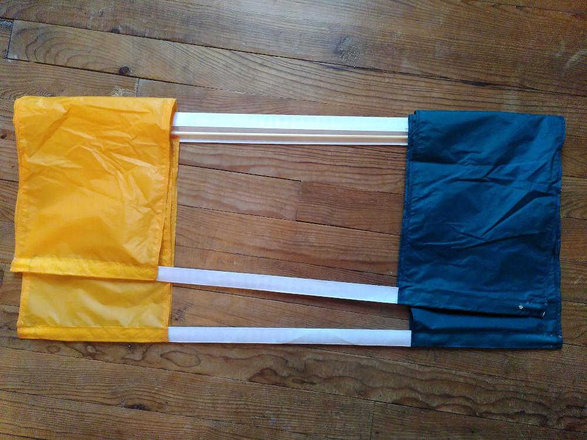

### 3.7 Pose des vergues
 - Couper 4 morceaux de tige de bois de 50cm chacun. 
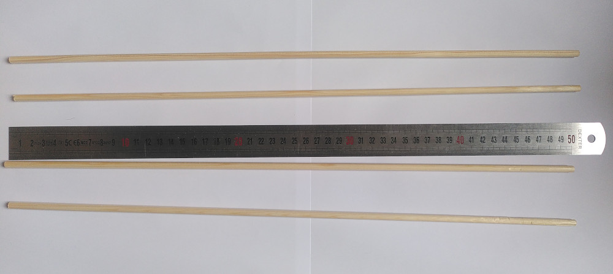
 - Emmancher à chaque extrémité un connecteur 6mm (*cf 2.3*).
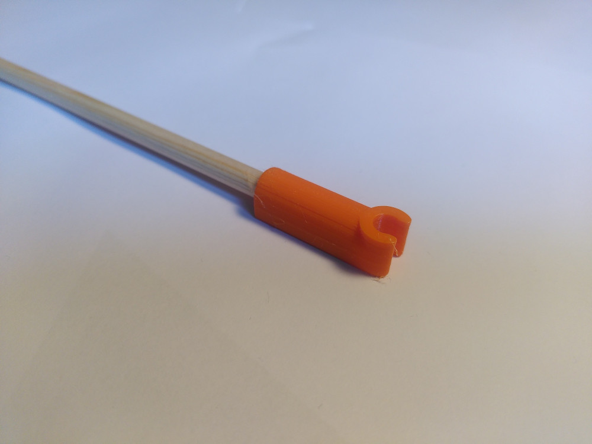
 - A l'intérieur du cerf-volant disposer les vergues (tiges de 50cm) en les clipsant aux longerons (tiges de 90cm) de manière à bien tendre la toile.
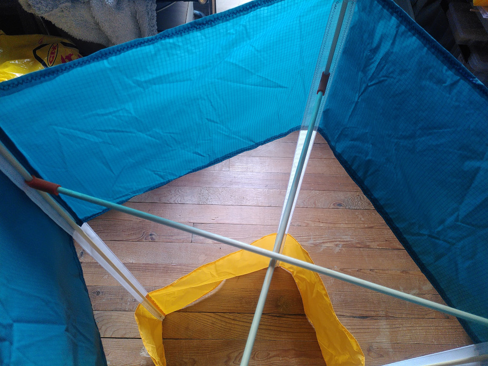
 - Raccourcir la longueur des baguettes si nécessaire. 
 - Faire de même pour chaque extrémité du cerf-volant (en haut et en bas).
 - L'assemblage des vergues peut se faire avant chaque vol de manière à pouvoir plier le cerf-volant lorsqu’il ne sert pas. 

### 3.8 Bridage
"Le bridage est l’assemblage des fils situés sur le cerf-volant. Ils répartissent les forces excercées sur la voile ou la structure et une fois noués ensemble ils créent les points d’attache des lignes de contrôle."([ennapurna.com](http://www.ennapurna.com/bride-dyneema-gainee.html))

 - Couper un morceau de ligne de 2m environ. 
 - Cautériser à l'aide d'un briquet les deux extrémité de ligne coupé.
 - Passer une première extrémité de ligne dans le trou du haut et la nouer avec un noeud de chaise autour du longeron.
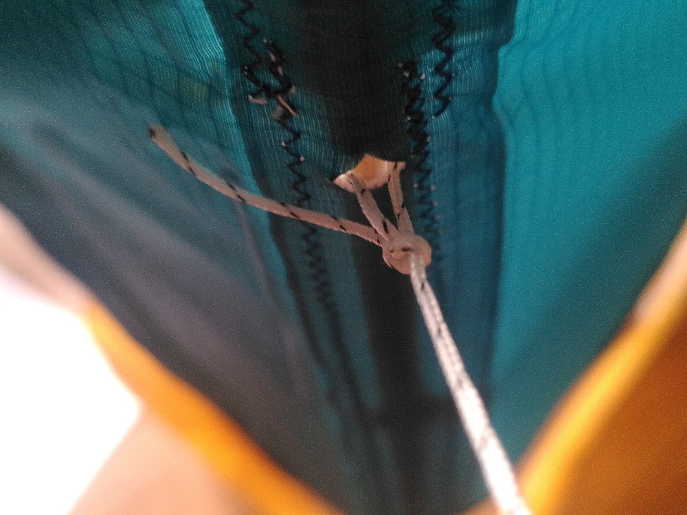
 - Passer la seconde extrémité dans le second trou et nouer de la même manière par un noeud de chaise. 
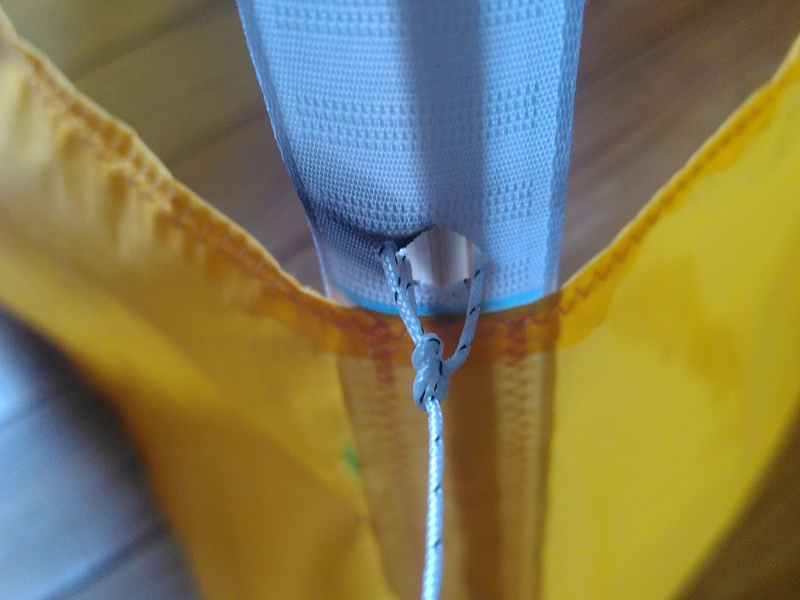
 - Réaliser une boucle avec la bride de manière à obtenir un angle droit entre le longeron et la bride partant de 4cm du bord du cerf-volant.
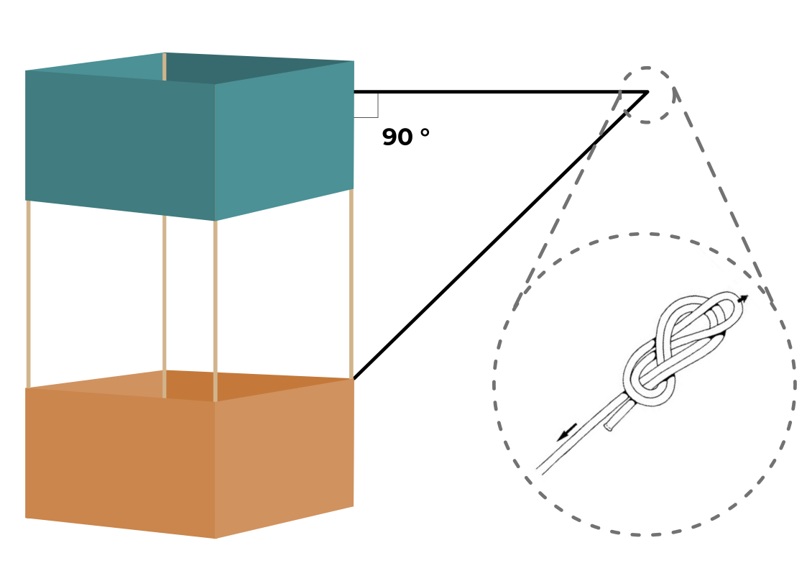