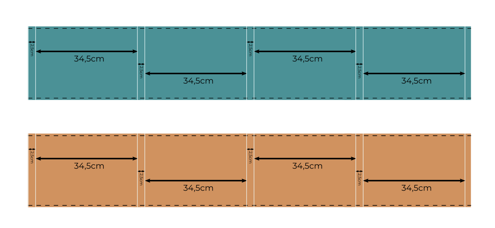
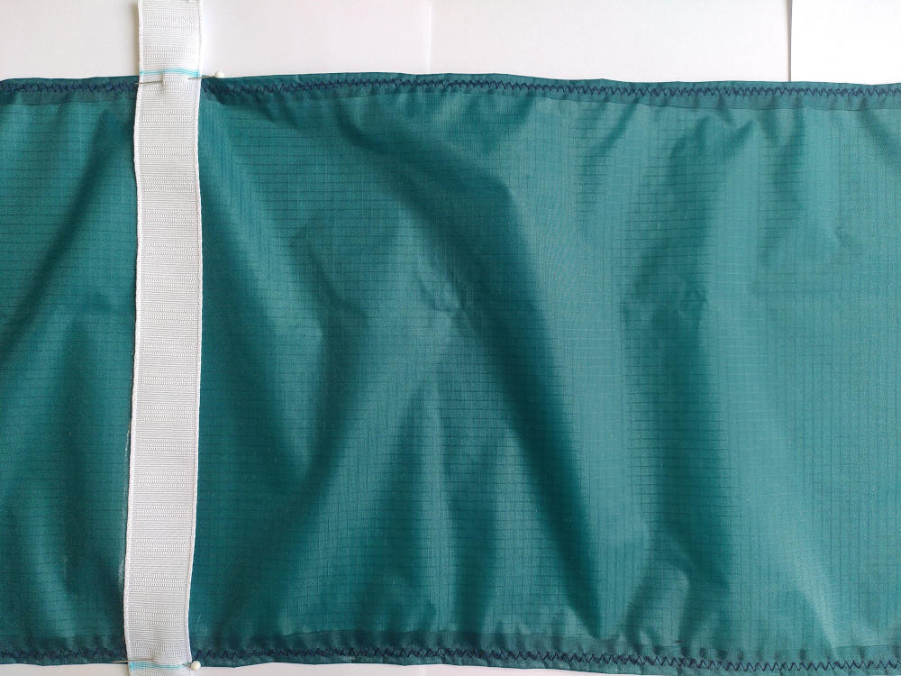

# Cerf-volant Cube (Toile)
## Introduction

## 2/ Matériel et fournitures nécessaire
### 2.1 Fournitures

|Dénomination|Visuel|Mes fournitures|Qt|
|------|------|-----|--|
|Toile de spi (2 bandes de 270mm*1500mm minimum)||[La boutique du cerf-volant](https://www.boutiqueducerfvolant.com/fr/153-tissu-spinnaker-mirai-.html)|1|
|Fil de couture||Gütermann Polyesther|1 / couleur|
|Bande extra-fort de 2,5cm de largeur|||4m|
||||1|
||||4|

### 2.2 Matériel
|Dénomination|Visuel|Mon matériel|Qt|
|------|------|-----|--|
|Paire de ciseaux de couture|||1|
|Machine à coudre||Singer F527C|1|
|Aiguille de machine à coudre||Schmetz Microtex T80/12|1|
|Règles et mètres rubans|||1|
|Craie de couture|||4|
 
## 3/ Réalisation

- Découper deux bandes de toile de 1,5m sur 27cm dans la toile de spi. Veiller au bon sens du fil.

- Marquer la ligne de couture à 1cm de chacun des long cotés. 
- Piquer les ourlets sur les deux bords de chaque bande. De préférence avec un point zig-zag.

- Sur chacune des bandes de toile tracer le positionnement des bandes extra-forts. En partant du bord à 2,5cm, puis 34,5cm puis 2,5...( cf. Schèma ci-dessous).

- Couper 4 bandes d'extra-fort de 96cm de longueur. 
- Positionner les quatre bandes d'extra-fort aux emplacement tracés préalablement. Ces dernières devront dépasser de 3cm de la bande de toile. Maintenir les pièces ensemble au moyen d'épingles. 

- Piquer le long des deux côtés l'extra-fort sur la toile de spi (avec un point zig-zag). On commencera la couture à 3cm du bord soit à 6cm du bout de l'extra-fort (cf. Schèma ci-dessous).

- A l'autre extrémité des bandes extra-fort, coudre la seconde bande de toile de manière simétrique à la première. Toujours laisser dépasser l'extra-fort de la bande de toile de 3cm, ainsi que ne débuter la couture qu'à 3cm du bord. 
