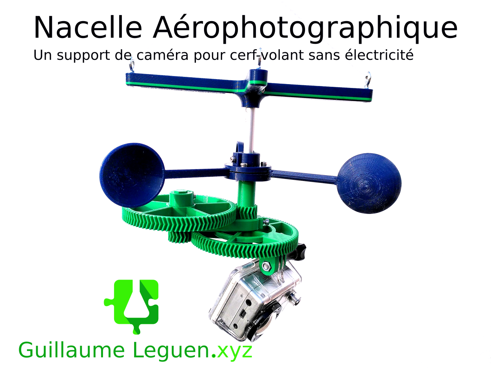

# Une nacelle rotative à energie éolienne

Imprimable en 3D, cette nacelle peut emporter une petite caméra de sport. Le système de godets semblable à anémomètre doit par l'action du vent mettre en mouvement les engranages qui permettront à la caméra de réaliser des tours sur elle même. En programmant la caméra pour réaliser des photos à intervale régulier. On peut obtenir une série de photos qu'il faudra par la suite trier. 

 - **Attention** cette version ne fonctionne actuellement pas. Le problème vient des godets qui ne captent pas suffisament d'énergie. Un travail est en cours pour faire évoluer le système de moulin.

 - Ce travail est inspiré d'une [création originale de UltiArjan disponible sur thingiverse.com](https://www.thingiverse.com/thing:681379). J'ai totalement re-modélisé le système proposé par le créateur afin de palier à quelques défauts qui rendait les assemblages difficiles, mais aussi et surtout pour remplacer l'axe principal initialement imprimé en 3D par un axe en aluminium de diamètre extérieur 8mm et de longueur 140mm. 

 - Toute la visserie utilisé est de la visserie inox M3 à tête fraisée hexagonale.

## 1. Matériel nécéssaire
 - Filament PLA, PETG ou autres (environ 100-200g)
 - Un morceau de tube aluminium 8mm*140mm
 - 1 vis M3*18mm
 - 1 vis M3 *16mm
 - 2 vis M3*10mm
 - 4 vis M3*12mm
 - 8 écrous M3
 - 2 anneaux brisés
 - 1 anneau métal 25mm ou moins
 - 2 petits mousquetons
 - De la garcette
 - Imprimante 3D FDM
 - Coupe tube
 - Limes
 - Foret de 3,5mm
 - Visseuse / Perceuse ou perceuse à colonne. 

## 2- Impression
 - Imprimer l'ensemble des pièces présentent dans le [répertoire au chemin /hardware/0-0-1/nacelle_eol/3DPrint_files](https://github.com/gheleguen/KonkArLab_KAP_KiteAerialPhotography/tree/main/hardware/nacelle_eol/0-0-1/3DPrint_files)
 - Les paramètres utilisés étaient 0,2mm d’épaisseur de couche et 10 ou 15% de remplissage. 
 - Nous avons utilisés une Prusa I3 Mk3s et une Prusa mini. 
 - Seul les godets et les supports de godets s'impriment avec du support. 
 - Nous avons utilisés du PLA de Arianeplast (Bleu navy et vert foncé). 

## 3- Assemblage
 - Couper à l'aide d'un coupe tube ou d'une scie à métaux, un morceau de tube d'aluminium de 140mm de longueur.  
 - A l'aide d'un foret à méteaux de 3,5mm, percer au travers du tube deux trous à 5mm du bord du tube aux deux extrémités. 
 - Assembler le système en suivant cette vidéo : https://youtu.be/mpRZ_lT7zSY
 

## 4- Liens utiles : 
 - Vidéo de démonstration : https://youtu.be/jim7L4yGIM4
 - Wik : http://www.guillaumeleguen.xyz/?PagePrincipale
 - Page de l'objet d'origine : https://www.thingiverse.com/thing:681379
 - Page Thingiverse de l'auteur de la version originale : https://www.thingiverse.com/ultiarjan/designs

