# 0-0-2 -- Nacelle èol à turbine d'Ugrinsky
## 1/ Introduction
Cette version est une évolution du projet en version 0.0.1. En effet, cette dernière peinait à tourner. 
Il a été question sur cette dernière version de réduire les frottements et de chercher une méthode plus effecace que les godets de type "anémomètre", pour capter l'énergie du Vent. 
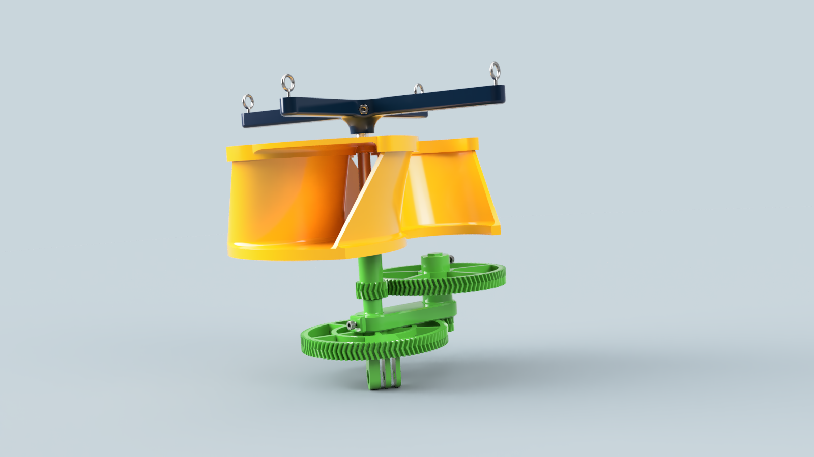

  
## 2/ Matériel et fournitures nécessaire
### 2.1 Fournitures
|Dénomination|Visuel|Où se fournir ?|Qt|
|------|------|-----|--|
|Bobine de PETG de diamètre correspondant à l'imprimante 3D qui sera utilisé||Arianeplast|400g|
|Tube d'aluminium de 8mm extérieur||Magasin de bricolage|l>170mm|
|Visserie M3||Amazon|1|

### 2.2 Matériel
 - Ordinateur
 - Imprimante 3D et son slicer
 - Scie à métaux
 - Foret de 3mm
 - Perceuse / Visseuse
 - Clés alens

   
## 3/ Réalisation
### 3.1 Impression des pièces
- Imprimer l'ensemble des pièces présentent dans le [répertoire au chemin /hardware/nacelle_eol/0-0-2/3DPrint_files](https://github.com/gheleguen/KonkArLab_KAP_KiteAerialPhotography/tree/main/hardware/nacelle_eol/0-0-2/3DPrint_files)
 - Les paramètres utilisés étaient 0,2mm d’épaisseur de couche et 10 ou 15% de remplissage. 
 - Nous avons utilisés une Prusa I3 Mk3s et une Prusa mini. 
 - Nous avons utilisés du PLA de Arianeplast (Bleu navy et vert foncé). 

### 3.2 Assemblage
 - Couper à l'aide d'un coupe tube ou d'une scie à métaux, un morceau de tube d'aluminium de 170mm de longueur.  
 - A l'aide d'un foret à méteaux de 3,5mm, percer au travers du tube deux trous à 5mm du bord du tube aux deux extrémités. 
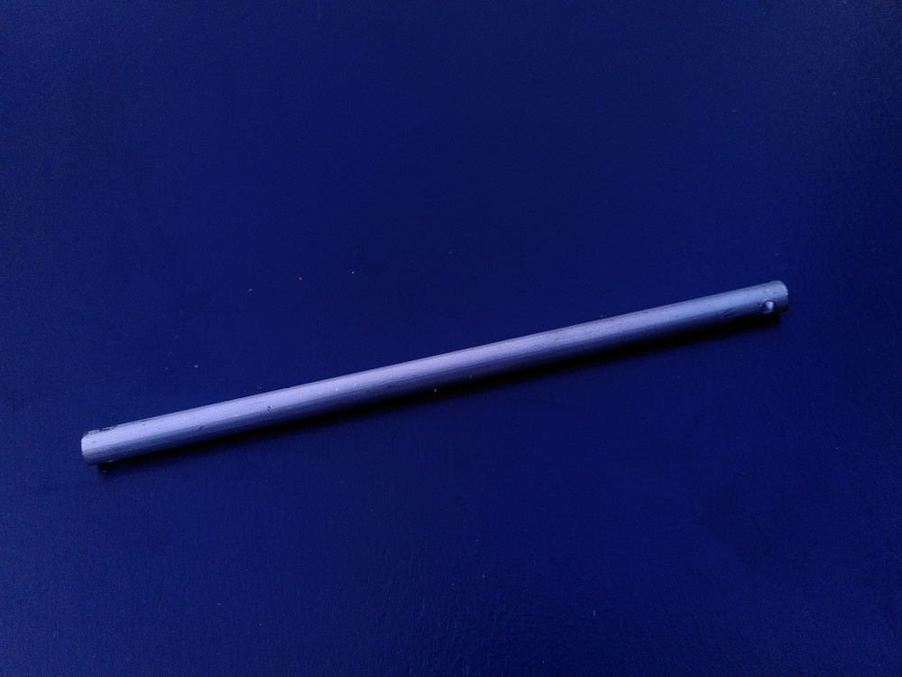

 - Insérer sur le tube l'entraxe. Insérer un écrou et prévisser sans serrer une vis M3* 12mm. 
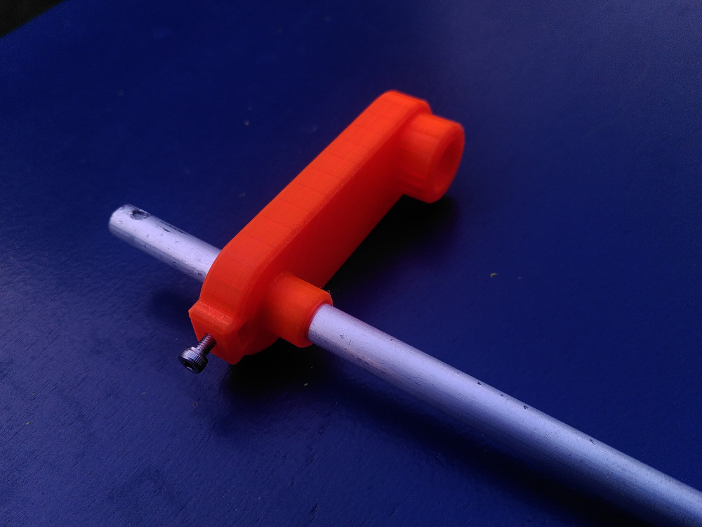

 - Insérer simultanément le second grand pignon et le second petit pignon. Le grand doit s'enfiler sur le tube et le petit traverser l'entraxe. 
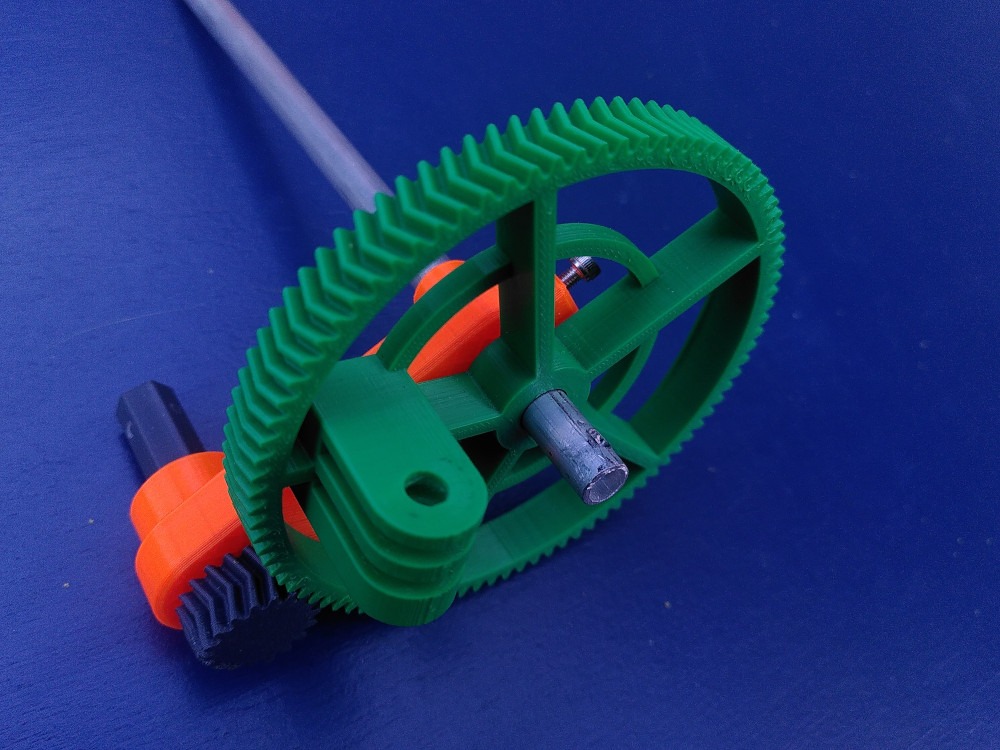

 - A l'aide d'une vis M3*12mm et d'un écrou fixer la bague de blocage de manière à empécher le second grand pignon de tomber. La vis traverssera le tube d'aluminium par le trou précédemment percé. 
 - Serrer la vis de l'entraxe de manière à laisser un jeu ni trop grand ni trop petit afin de ne pas géner la rotation du second granpignon.
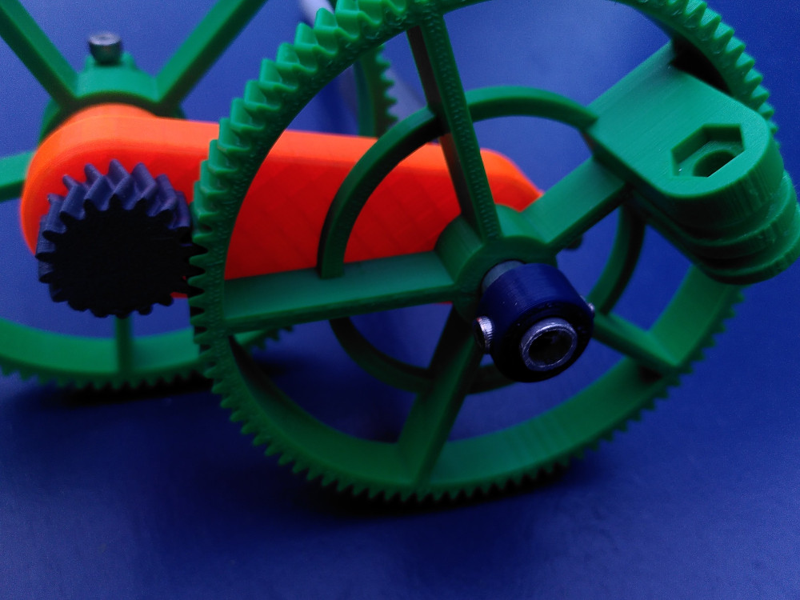

 - Insérer simultanément le premier grand et le premier petit pignon. Le grand s'insère sur le prisme du second petit pignon. Quand au premier petit il s'enfile sur le tube. 
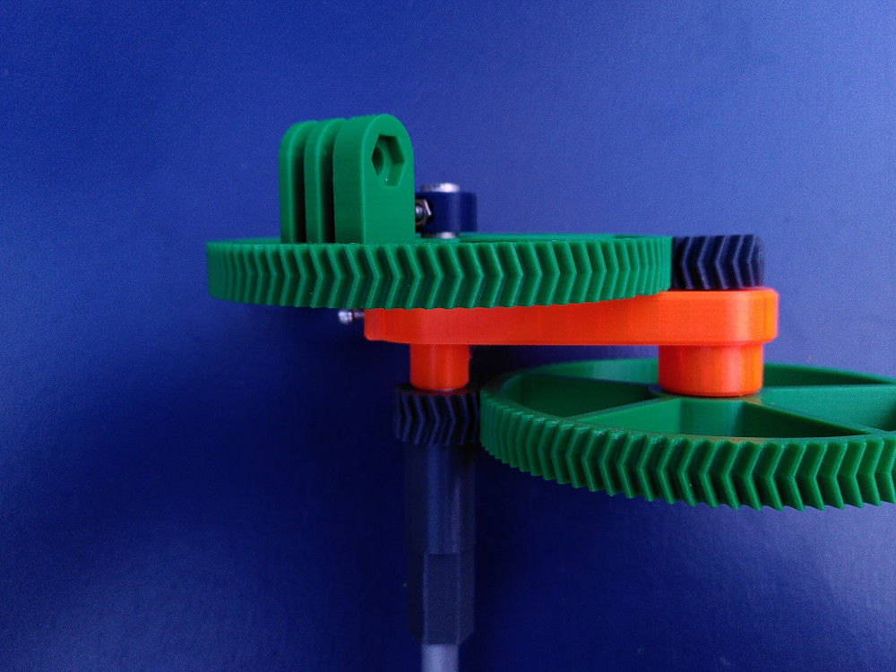

 - Insérer dans la partie inférieur de la turbine, un écrou. Pré-visser une vis M3*12mm. 
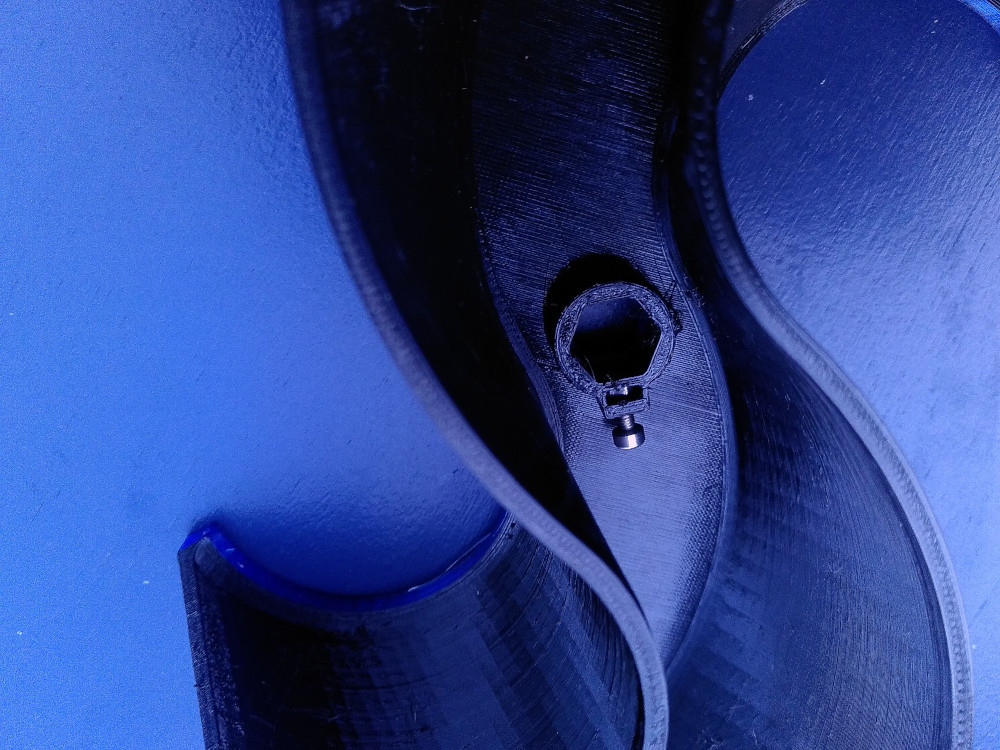

 - Insérer la partie basse de la turbine sur le prisme du premier petit pignon. Serrer la vis pré-disposé. 
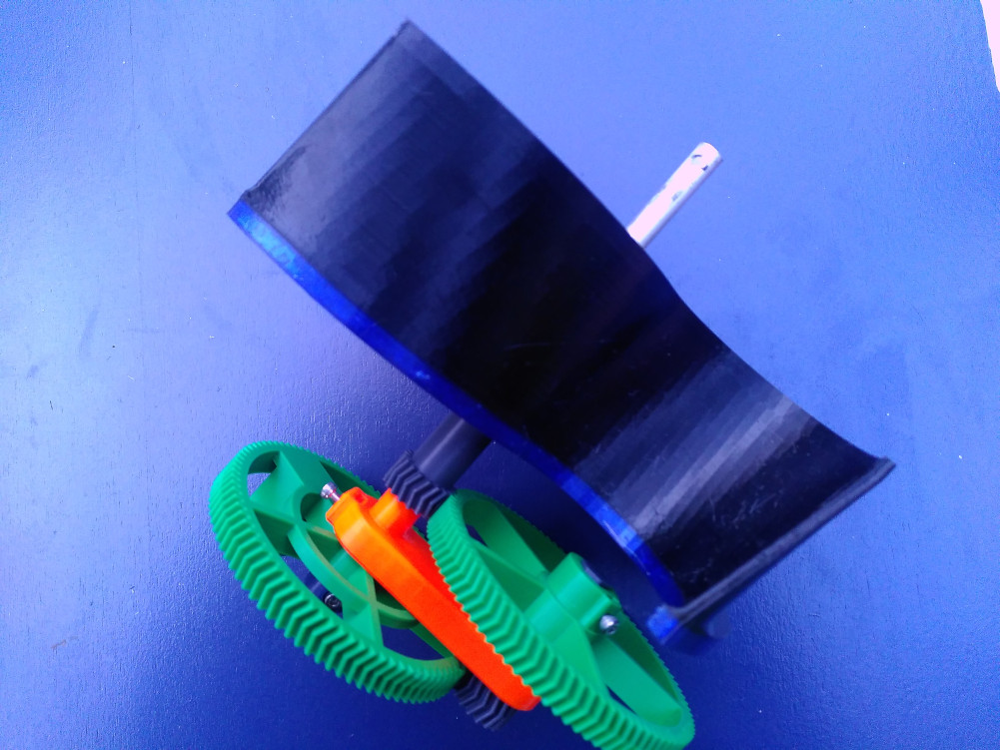

 - Positionner par dessus, la partie haute de la turbine. Cette pièce pourra être collé. 
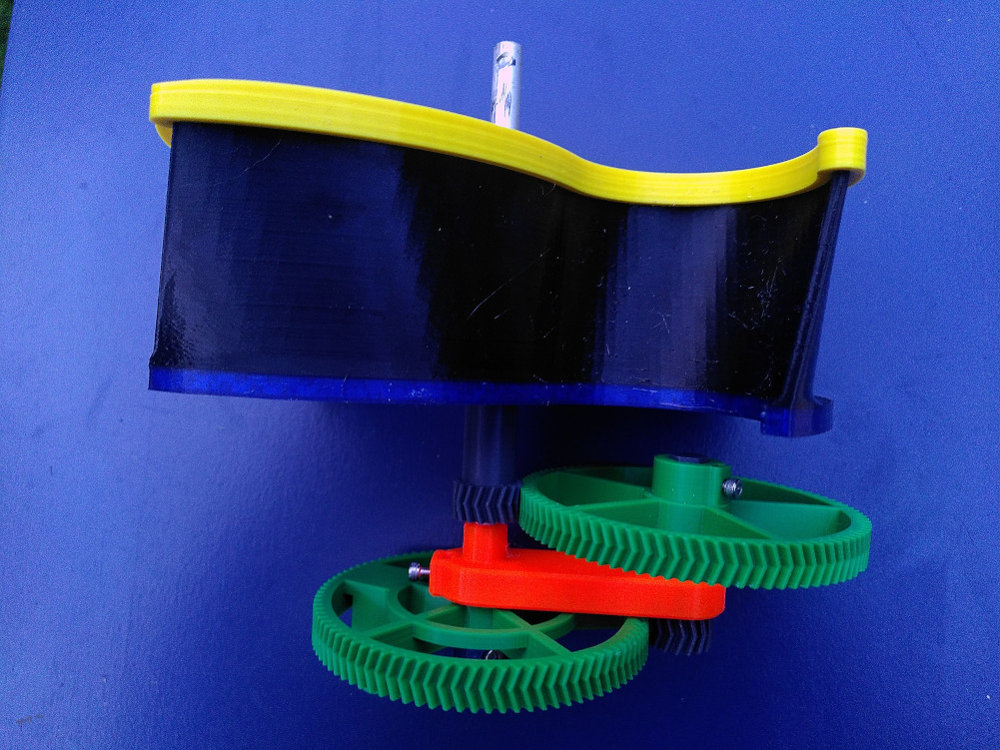

 - Visser le picavet au moyen d'une vis M3*25mm et d'un écrou en traverssant le tube aluminium. 
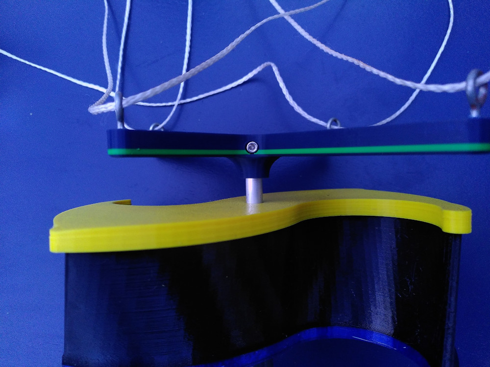

  
## 4/ Références et développement. 
Je suis partis de deux modèles 3D partagés sur thingiverse : 
 - [Un premier proposant un mécanisme de picavet éolien](https://www.thingiverse.com/thing:681379) Qui par ailleur est l'inspiration unique pour la version 0.0.1
 - [Un second pour les dimentions de la turbine de Ugrinsky](https://www.thingiverse.com/thing:996946). Ce dernier tuto propose un plan de construction de cette turbine. Ce dernier m'a servi de base pour dessiner la turbine. 
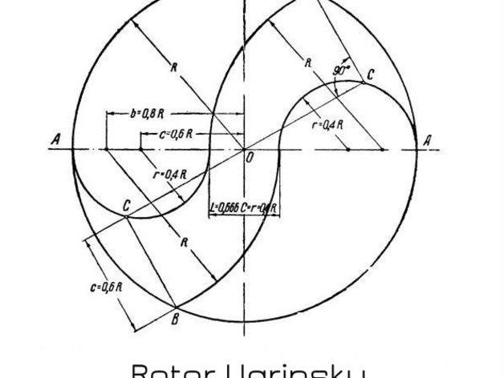

Afin de limiter les frottements, nous avons diminué les surface en contact comme par exemple entre le petit pignon et le tube d'aluminium en pratiquant un épaulement. 
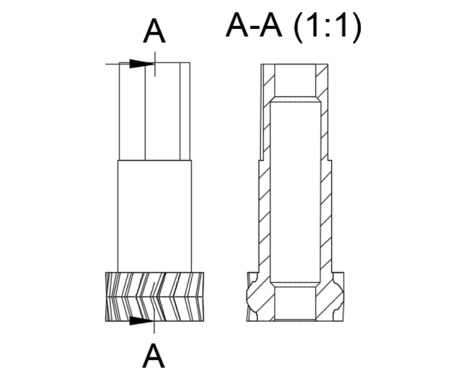

  
## 5/ Commentaires & Améliorations
 - Cette version est en cours de test
